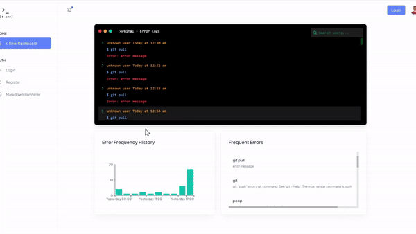

# T-Error

## Overview

Want to debug the elusive issues developers run into in the terminal? Adopt T-Error and analyze _every single_ std error output your team encounters on our modern web dashboard! Built with Next.js, TypeScript, and Material-UI on the frontend, and powered by Express on the backend. T-Error is the future of project management, from weekend hackathon projects to enterprise-level software.

## Table of Contents

- [T-Error](#T-Error)
  - [Overview](#overview)
  - [Table of Contents](#table-of-contents)
  - [Features](#features)
  - [Installation](#installation)
  - [Usage](#usage)
  - [Environment Variables](#environment-variables)
  - [Contributing](#contributing)

## Features

- Seamless terminal integration, run **one** script and start tracking your errors! 🚀
- Data visualization of the error trends, which commands are screwing up the devs? 📊
- Solution database - find the solution to your error, right through your terminal! ✅

## 🌐 Live demo

You can view a live demo of the project [here](https://hackharvard2024-2jvq.vercel.app/).



## Installation

1. Clone the repository:

   ```sh
   git clone https://github.com/PratikPaudel/your-repo.git
   cd your-repo
   ```

2. Set up environment variables:
   Create a `.env.local` file in the root directory.
   Obtain your MongoDB connection details and API key, then add the following line to the `.env.local` file:

   ```dotenv
   NEXT_PUBLIC_API_URL=http://localhost:3001
   ```

3. Set up the backend:
   Navigate to the backend directory and install the required dependencies:

   ```sh
   cd ./backend
   npm install
   ```

   Start the Express server:

   ```sh
   node index.js
   ```

4. Set up the frontend:
   Navigate to the frontend directory, install the dependencies, and start the application:

   ```sh
   cd ../frontend
   npm install
   npm run dev
   ```

## Usage

1. Open your browser and navigate to `http://localhost:3000`.


